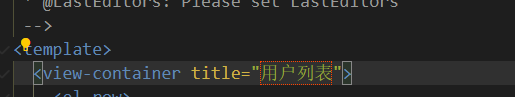
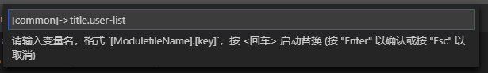

### 基于[kiwi](https://github.com/alibaba/kiwi)的二次开发，添加对vue-template 和 TypeScript的支持。并集成 Leaf 项目下的国际化方案 ### 


 

> ## 1. 更新 Leaf 到最新版本

```bash
update leaf

```

> ## 2. 安装 vue-i18n;

```bash
npm install --save-dev vue-i18n

```

> ## 3. @src/plugins 下新建 i18n.ts

```typescript
// @src/plugins i18n.ts

import VueI18n from 'vue-i18n';
//@ts-ignore
import enLocale from 'element-ui/lib/locale/lang/en';
//@ts-ignore
import zhLocale from 'element-ui/lib/locale/lang/zh-CN';
import commonI18n from '@/i18n/common';

interface LanguagePkg {
  'zh-CN': {
    [key: string]: {
      [key: string]: string;
    };
  };
  en?: {
    [key: string]: {
      [key: string]: string;
    };
  };
}

class LeafI18n {
  private i18nPkg: LanguagePkg = {
    'zh-CN': {},
    en: {}
  };

  private deepObjectMerge = (FirstOBJ: any, SecondOBJ: any) => {
    for (var key in SecondOBJ) {
      FirstOBJ[key] =
        FirstOBJ[key] && FirstOBJ[key].toString() === '[object Object]'
          ? this.deepObjectMerge(FirstOBJ[key], SecondOBJ[key])
          : (FirstOBJ[key] = SecondOBJ[key]);
    }
    return FirstOBJ;
  };

  public i18nMerge = (i18n: LanguagePkg) => {
    this.i18nPkg = this.deepObjectMerge(this.i18nPkg, i18n);
  };

  public init = () => {
    const allI18n = require.context('@/views', true, /i18n\.ts$/);
    allI18n.keys().forEach(key => {
      allI18n(key);
    });
    this.i18nPkg = this.deepObjectMerge(this.i18nPkg, commonI18n);

    const messages: any = {
      en: {
        ...enLocale,
        ...this.i18nPkg.en
      },
      'zh-CN': {
        ...zhLocale,
        ...this.i18nPkg['zh-CN']
      }
    };

    let lang =
      (localStorage.getItem('lang')
        ? localStorage.getItem('lang')
        : navigator.language) || 'zh-CN';

    return new VueI18n({
      locale: lang,
      messages
    });
  };

  public getI18nPkg = () => {
    return this.i18nPkg;
  };
}

const leafI18n = new LeafI18n();
const i18nMerge = leafI18n.i18nMerge;

export { leafI18n, i18nMerge };
```

> ## 4. @src/i18n 下新建 common.ts

```typescript
// @src/i18n common.ts
const i18n = {
  'zh-CN': {}
};
export default i18n;
```

> ## 5. main.ts 下 加入如下代码

```typescript
// main.ts
/************ 国际化初始化  ************/
import VueI18n from 'vue-i18n';
import Element from 'element-ui';
import { leafI18n } from './plugins/i18n';

App.Vue.use(VueI18n);
const i18n = leafI18n.init();
// @ts-ignore
window.i18n = i18n;
App.Vue.use(Element, {
  i18n: (key: any, value: any) => i18n.t(key, value)
});
/************ 国际化 END  ************/
new App({
  theme: 'default',
  vueOptions: {
    i18n
  },
  beforeCreate: async (app: any) => {},
  getData: async (app: any) => {}
}).run('#app');
```

> ## 6. @src/shims-tsx.d.ts 中增加类型声明

```typescript
// @src/shims-tsx.d.ts
import VueI18n from 'vue-i18n';
declare namespace I18nSpace {
  interface I18n {
    t(key: VueI18n.Path, values?: VueI18n.Values): string;
  }
}

declare global {
  const i18n: I18nSpace.I18n;
}
```

> ## 7. 推荐安装 leaf-i18n vscode 插件


### 7.1 leaf-i18n 功能

- 1 识别打开文件中的中文。并用红色方框标记。

  

- 2 识别打开文件中的 i18n 语法。并在行末尾做翻译提示


* 3 鼠标移动到中文上面，会在左侧出现一下黄色小灯泡。点击小灯泡会弹出菜单。

  

* 3 会将中文自动抽取到局部或全局的 i18n 配置文件中。
* 4 vue-template 中 会自动将红框内文本替换为 {{$t('xxx')}} :label="\$t('xxx')"
* 5 TypeScript 中 会替换为 i18n.t('xxx')

### 7.2 leaf-i18n 使用

#### 插件会自动试别 vscode 打开文件中的中文。并用红色方框标记。鼠标移动到中文上面，会在左侧出现一下黄色小灯泡。点击小灯泡会弹出菜单。


菜单如上图所示
痛点：

变量已经替换，还要重新输入，比如每个页面都有【确认】按钮

一页上有好几处，每个都要输入

vue 的模板， label = "",需要输入冒号,引号

- 1 变量已经存在，识别中文，会自动匹配已经存在语言包，将中文替换。
- 2 抽取在当前文件夹
- 3 抽取在 @src/i18n/i18n.ts 下的 common.ts 作为公共翻译,可以输入 title.add 这种形式的 key


